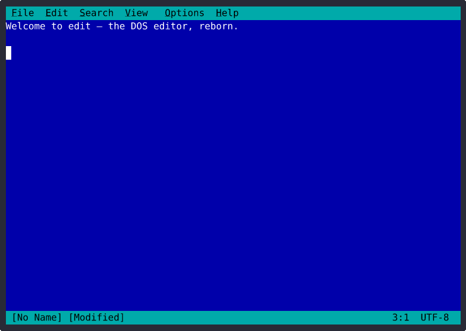

# edit

> A faithful MS-DOS **EDIT.COM** for the modern terminal — cross-platform (Linux, BSD, macOS, MyOS),
> DOS look-and-feel, Unicode soul.

[](docs/STATUS.md)
[](Cargo.toml)
[](docs/STATUS.md)
[](LICENSE)
[](CHANGELOG.md)

<p align="center">
  
</p>

<p align="center">
  <em>The DOS editor, reborn for your terminal — UTF-8 native, mouse-aware, plugin-extensible.</em>
</p>

`edit` recreates the unmistakable blue-screen experience of Microsoft's MS-DOS text editor —
pull-down menus, F-key bindings, and a status bar — as a single, fast, portable native binary that
runs on **Linux, FreeBSD, macOS, and MyOS**. Unlike the original, it is **UTF-8/Unicode native from
the ground up**, written in **Rust** with
[`ratatui`](https://ratatui.rs) and [`crossterm`](https://github.com/crossterm-rs/crossterm), and
extensible through a **sandboxed plugin API**.

> The animation above is generated deterministically from the editor itself — run `make demo-gif` to
> rebuild [`assets/demo.gif`](assets/demo.gif) from a scripted session ([`examples/demo_cast.rs`](examples/demo_cast.rs)).

---

## ✨ Why `edit`?

- **DOS-faithful TUI** — classic blue background, pull-down menu bar (File / Edit / Search / View /
  Options / Help), F-key bindings, and a live status bar. Full keyboard menu navigation
  (`F10`, `Alt+<letter>`, arrows, `Enter`, `Esc`).
- **Unicode native** — UTF-8 everywhere, grapheme-aware cursor movement and editing.
- **Legacy codepage transcoding** — read and write CP437, CP850, ISO-8859-1, Windows-1252, and
  UTF-16 LE/BE with BOM auto-detection and byte-identical round-trips.
- **Syntax highlighting** — C/C++, Python, Shell, YAML, and Markdown out of the box.
- **Soft-wrap mode** — optional visual line wrapping with a `»` continuation marker (`Alt+Z`).
- **Multi-buffer & split view** — open many files, cycle buffers, split the screen.
- **Session restore & crash recovery** — pick up where you left off; auto-save protects against
  crashes via the `EDIT-RECOVERY-V1` format.
- **External file-change watching** — get prompted to reload when another process rewrites the
  file under you; a notice if it's deleted.
- **Sandboxed plugin API** — extend the editor with **Rhai** scripts: custom syntax highlighters,
  keybindings, and top-level menus, all in a default-deny sandbox.
- **Single binary** — no X11/Wayland, no glibc lock-in; static musl builds available.

---

## 🧩 Part of MyOS

`edit` is developed as a **standalone, OS-agnostic terminal editor** that is also destined to ship
as the built-in text editor of **[MyOS](https://github.com/mohnkhan/MyOS2026)** — a from-scratch
x86_64 operating system written in Rust (with a Linux-compatible syscall ABI) that this repository
lives within (`/MyOS-2026/`). It is designed to stand on its own anywhere a terminal runs —
**Linux, FreeBSD, and macOS** (per the project constitution), in addition to MyOS — while fitting
cleanly into MyOS as a dependency-light, self-contained component. You can use it today; MyOS will
adopt it as a first-class part of its base userland.

---

## 📦 Installation

### Prerequisites

- **Rust 1.74+** (MSRV) and `cargo` — see [rustup.rs](https://rustup.rs)
- A terminal emulator with UTF-8 support

### Build from source

```bash
git clone <repo-url> edit && cd edit

make build      # debug binary   → target/debug/edit
make release    # optimized, LTO, stripped → target/release/edit
make static     # static musl binary (requires the musl target + nightly)
```

The static build produces a fully self-contained binary with no glibc dependency at
`target/x86_64-unknown-linux-musl/release-static/edit`.

### Packaging

```bash
make package-deb    # .deb via cargo-deb
make package-rpm    # .rpm via rpmbuild + packaging/edit.spec
```

### Supported targets

| Target | Toolchain | Profile |
|---|---|---|
| `x86_64-unknown-linux-gnu` | stable 1.74+ | debug, release |
| `aarch64-unknown-linux-gnu` | stable 1.74+ (cross) | debug, release |
| `x86_64-unknown-linux-musl` | nightly | `release-static` |
| `x86_64-unknown-freebsd` | stable 1.74+ | debug, release |
| `x86_64-apple-darwin` | stable 1.74+ | debug, release |
| `aarch64-apple-darwin` | stable 1.74+ | debug, release |

`edit` is **OS-agnostic, pure-Rust** with no platform-specific runtime dependency, so it builds from
the same source on every target above (Linux, FreeBSD, macOS — and MyOS, where it ships as the
built-in editor). Linux x86_64 is the primary CI-gated target; the others are supported per the
[project constitution](.specify/memory/constitution.md) (Principle III — Portable Build).

---

## 🚀 Usage

```bash
edit [OPTIONS] [FILE...]
```

Open one or more files, or launch with no arguments for a blank buffer (or a session-restore
prompt). A man page is installed at `man/edit.1`.

### Common options

| Flag | Description |
|---|---|
| `--encoding <ENC>` | Force file encoding (`utf-8`, `cp437`, `cp850`, `iso-8859-1`, `windows-1252`, `utf-16-le`, `utf-16-be`, `utf-16`) |
| `--legacy-cp437` | Enable CP437 → UTF-8 transcoding on open |
| `--theme <NAME>` | `classic` (default), `high-contrast`, or `plain` |
| `--line-numbers` | Show the line-number gutter |
| `--no-highlight` | Disable syntax highlighting |
| `--readonly` | Open all files read-only |
| `--no-session` | Skip the session-restore prompt |
| `--no-watch` | Disable external file-change watching |
| `--no-plugins` | Disable plugin loading for this session |
| `--no-autosave` | Disable auto-save / crash recovery |
| `--locale <LOC>` | Override locale detection (e.g. `C.UTF-8`) |
| `--version` / `--help` | Print version / help and exit |

See [`docs/CAPABILITIES.md`](docs/CAPABILITIES.md) for the complete flag reference.

### Quickstart

```bash
edit notes.md                       # open a file
edit --theme high-contrast log.txt  # accessible color scheme
edit --encoding cp437 README.DOC    # open a legacy DOS file
edit --line-numbers src/main.rs     # show line numbers
```

---

## ⌨️ Keybindings

A curated selection of the defaults — see [`docs/CAPABILITIES.md`](docs/CAPABILITIES.md) or
[`wiki/Keybindings.md`](wiki/Keybindings.md) for the full table.

| Category | Key | Action |
|---|---|---|
| **File** | `Ctrl+S` / `F5` | Save |
| | `F12` | Save As with encoding selection |
| | `Ctrl+O` / `Ctrl+N` | Open / New |
| | `Ctrl+W` | Close buffer |
| | `Ctrl+Q` | Quit (prompts if unsaved) |
| **Edit** | `Ctrl+Z` / `Ctrl+Y` | Undo / Redo |
| | `Ctrl+X` / `Ctrl+C` / `Ctrl+V` | Cut / Copy / Paste |
| | `F8` / `F9` / `F11` | Cut / Copy / Paste (DOS F-keys) |
| | `Ctrl+A` | Select all |
| | `Ctrl+Backspace` / `Ctrl+Delete` | Delete word left / right |
| **Navigate** | `←` `→` `↑` `↓` · `Home` / `End` | Move · line start / end |
| | `Ctrl+←` / `Ctrl+→` | Word left / right |
| | `PgUp` / `PgDn` | Page up / down |
| **Select** | `Shift+←/→/↑/↓` · `Shift+Home/End` | Extend selection |
| | `Ctrl+Shift+←` / `Ctrl+Shift+→` | Select word left / right |
| **Search** | `Ctrl+F` / `Ctrl+H` | Find / Find & Replace |
| | `F3` / `F2` | Find next / previous |
| | `Ctrl+G` | Go to line |
| **Buffers** | `F6` / `Shift+F6` | Next / previous buffer |
| **View** | `Alt+Z` | Toggle soft-wrap |
| **Menus** | `F10` | Activate menu bar |
| | `Alt+F/E/S/V/O/H` | Open File / Edit / Search / View / Options / Help |
| | `Esc` | Close menu / cancel dialog |

> 🖱️ **Mouse, too:** click to position the caret, drag to select, double-click a word / triple-click a
> line, right-click for a context menu, scroll with the wheel, and click menus, tabs, buttons, and
> scrollbars.

---

## 🔌 Plugins

`edit` ships a **Rhai-based plugin API** ([feature 008](CHANGELOG.md)) so you can extend the editor
without touching its source. Plugins live in `$XDG_CONFIG_HOME/edit/plugins/<id>/` as a
`plugin.toml` manifest plus an optional `plugin.rhai` script, and can provide:

- **Syntax highlighters** — take precedence over the built-in highlighter for their file types.
- **Keybindings** — merge into the keymap (Save and Quit cannot be overridden).
- **Menu items** — contribute top-level menus rendered between *Options* and *Help*, activatable
  from the keyboard ([feature 009](CHANGELOG.md)).

Every newly installed plugin requires a **one-time consent dialog** before it runs, and executes in
a **default-deny sandbox**: no filesystem, process, or network access except a permission-gated
`read_file`. Each call is bounded to **50 ms**, and a misbehaving plugin is disabled for the session
so the editor stays responsive. Manage plugins via **Options › Plugins**, or disable all of them
with `--no-plugins`.

Reference plugins live in [`examples/plugins/`](examples/plugins/): `word-count`, `custom-keys`,
`lua-syntax`, plus the `fs-violation` and `infinite-loop` sandbox test fixtures. See
[`wiki/Plugin-Development.md`](wiki/Plugin-Development.md) to write your own.

---

## ⚙️ Configuration

| What | Location |
|---|---|
| Config file | `$XDG_CONFIG_HOME/edit/config.toml` (default `~/.config/edit/config.toml`) |
| Plugin consent | `$XDG_CONFIG_HOME/edit/plugins.toml` |
| Recovery files | `$XDG_STATE_HOME/edit/recovery/` |
| Logs | `$XDG_STATE_HOME/edit/logs/edit-<date>.log` |
| Crash reports | `$XDG_STATE_HOME/edit/crash-<timestamp>.log` |

**Themes:** `classic` (DOS blue, default), `high-contrast` (accessibility), and `plain` (terminal
default colors). Set via `--theme`, the Options menu, or `config.toml`. The full schema lives in
`src/config/schema.rs`.

---

## 🛠️ Development

`edit` is built with a [Spec Kit](specs/) driven workflow — each feature has a numbered directory
under [`specs/`](specs/) with its spec, plan, and tasks.

```bash
make check        # unit + integration tests (cargo test)
make smoke        # expect-based TUI smoke tests (needs expect + tmux)
make perf-check   # Criterion benchmarks
make stress-test  # 5-minute continuous-editing stress test
make ci-local     # full gate: fmt → clippy → test → smoke → bench
```

> 💾 **Save your SSD**: `make tmpfs-setup` redirects `target/` (the only large gitignored output
> tree) into `/tmp/edit/<hash>/` so Cargo's write-heavy build cycle hits RAM instead of the SSD.
> Reversible (`make tmpfs-teardown`), idempotent, opt-in, no-op on CI. See
> [`docs/dev-tmpfs.md`](docs/dev-tmpfs.md).

### Module layout (`src/`)

| Module | Responsibility |
|---|---|
| `buffer/` | Rope-backed text buffer, undo/redo, auto-save |
| `ui/` | `ratatui` widgets: menu bar, dialogs, status bar, soft-wrap |
| `encoding/` | Detection + transcoding (UTF-8/16, CP437/850, Latin-1, CP1252) |
| `highlight/` | Syntax highlighting pipeline |
| `plugin/` | Rhai engine, sandbox, manifest loading, consent |
| `watcher/` | External file-modification detection (inotify via `notify`) |
| `session/` | Session save/restore |
| `search/` | Find & replace with regex |
| `input/` | Keymap and key handling |
| `config/` | TOML config schema and persistence |
| `security/` | Path-traversal guards, sandbox helpers |
| `diagnostics/` | Logging, crash handler |

---

## 🗺️ Roadmap

Features 001–009 are complete (see [`CHANGELOG.md`](CHANGELOG.md) and [`docs/STATUS.md`](docs/STATUS.md)).
Planned and deferred work — along with the issues tracking it — lives in [`ROADMAP.md`](ROADMAP.md).

---

## 📚 Documentation

- **[Project Wiki](wiki/Home.md)** — start here
- [Installation](wiki/Installation.md)
- [Keybindings](wiki/Keybindings.md)
- [Plugin Development](wiki/Plugin-Development.md)
- [Architecture](wiki/Architecture.md)
- [Capabilities reference](docs/CAPABILITIES.md) · [Status](docs/STATUS.md) · [Changelog](CHANGELOG.md)

---

## 🤝 Contributing

Contributions are welcome! A few project conventions:

- Branch per change, named `NNN-short-description` (e.g. `010-line-numbers-gutter`), branched from
  `origin/master`.
- PRs target `master` and are merged via GitHub — never commit directly to `master`.
- Feature PRs must update `CHANGELOG.md` and `docs/STATUS.md` (and `docs/CAPABILITIES.md` for any
  user-visible change). Run `make ci-local` before opening a PR.

---

## 📄 License

Released under the **Mozilla Public License 2.0**, matching the parent
[MyOS](https://github.com/mohnkhan/MyOS2026) project. See [`LICENSE`](LICENSE).
